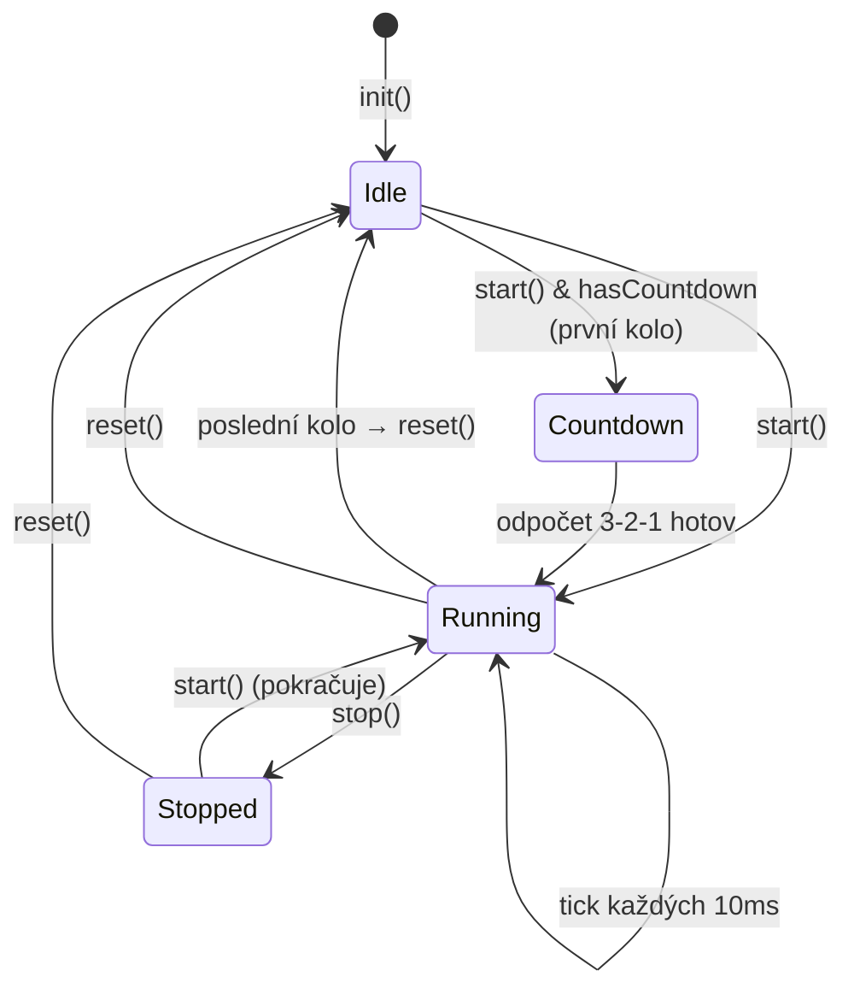
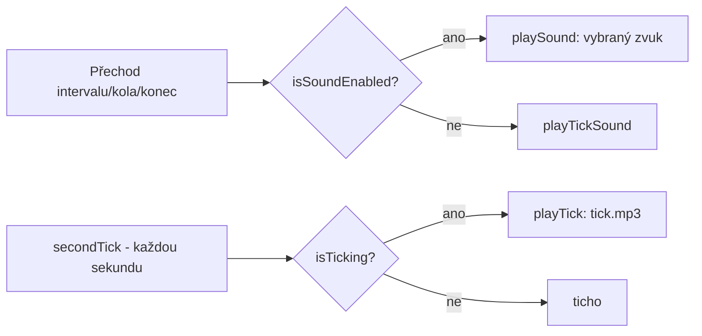

# GustavTimer 🏋️

> [!abstract] O čem to je
> **GustavTimer** je iOS aplikace (SwiftUI) pro **intervalové cvičení** – tzv. workout/HIIT timer. Uživatel si poskládá libovolný počet pojmenovaných intervalů (např. `Work 30s` → `Rest 15s`), nastaví počet kol (nebo nekonečnou smyčku) a aplikace ho provází tréninkem pomocí velkého odpočtu, vizuálních progress barů, zvukové a haptické zpětné vazby. Časovače lze ukládat mezi oblíbené, sdílet odkazem a vybírat z předpřipravených presetů (Tabata, EMOM, HIIT, AMRAP, meditace).

---

## Obsah

1. [[#1 · Základní informace]]
2. [[#2 · Architektura]]
3. [[#3 · TimerEngine – jádro odpočtu]]
4. [[#4 · Datový model a persistence]]
5. [[#5 · Hlavní obrazovka (TimerView)]]
6. [[#6 · Nastavení (SettingsView)]]
7. [[#7 · Oblíbené a předdefinované timery]]
8. [[#8 · Zvuky, tikání a haptika]]
9. [[#9 · Pozadí (Background)]]
10. [[#10 · Deep Linky]]
11. [[#11 · Onboarding a What's New]]
12. [[#12 · Hodnocení v App Store]]
13. [[#13 · Analytika (TelemetryDeck)]]
14. [[#14 · Lokalizace]]
15. [[#15 · Design systém (GustavUI)]]
16. [[#16 · Konfigurace (AppConfig)]]
17. [[#17 · Přehled klíčů UserDefaults]]
18. [[#18 · Mapa souborů]]
19. [[#19 · Poznámky k implementaci a TODO]]

---

## 1 · Základní informace

| Vlastnost | Hodnota |
|---|---|
| Název | GustavTimer |
| Bundle ID | `cz.daliborjanecek.GustavTimer` |
| Marketingová verze | **2.3.0** |
| Interní verze (`AppConfig.version`) | **201** |
| Cílová platforma | iOS (deployment target **18.0**, část konfigurací 16.4) |
| UI framework | **SwiftUI** |
| Persistence | **SwiftData** + `@AppStorage` (UserDefaults) |
| Jazyk | Swift 5.0 |
| URL scheme | `gustavtimerapp://` |
| Autor | Dalibor Janeček |

### Externí závislosti

| Balíček | Verze | Účel |
|---|---|---|
| **TelemetryDeck SwiftSDK** | 2.12.0 | Anonymní analytika (signály o používání) |
| **Lottie** (airbnb/lottie-ios) | 4.4.0+ | Vektorové animace ikon (přes GustavUI) |
| **rive-ios** | 6.11.1 | Historická závislost (viz [[#19 · Poznámky k implementaci a TODO]]) |
| **GustavUI** (lokální SPM balíček) | — | Sdílený design systém (barvy, fonty, komponenty, animace) |

> [!info] GustavUI balíček
> `GustavUI` je samostatný lokální Swift Package (`/git/GustavApps/GustavUI`) sdílený napříč aplikacemi Gustav (Timer, Weights, AtWork). Dělí se na dva produkty:
> - **GustavUICore** – barvy, fonty, layout, ikony, onboarding (iOS + watchOS).
> - **GustavUIAnimations** – Lottie animace (pouze iOS).
>
> Detaily v sekci [[#15 · Design systém (GustavUI)]].

---

## 2 · Architektura

Aplikace má **třívrstvou architekturu** s důrazem na sdílení čisté logiky:

```mermaid
flowchart TB
    subgraph Shared["🧠 Shared (čistá logika, žádné UIKit/SwiftUI)"]
        TE[TimerEngine]
        ID[IntervalData]
        SM[SoundModel]
        TDF[TimeDisplayFormat]
    end

    subgraph iOS["📱 iOS vrstva"]
        VM[TimerViewModel]
        TV[TimerView]
        SV[SettingsView]
        FV[FavouritesView]
        SND[SoundManager]
        AC[AppConfig]
        AS[AppSettings]
    end

    subgraph Persist["💾 Persistence"]
        SD[(SwiftData<br/>TimerData, CustomImageModel)]
        UD[(UserDefaults<br/>@AppStorage)]
    end

    subgraph GustavUI["🎨 GustavUI balíček"]
        Core[GustavUICore<br/>barvy, fonty, komponenty]
        Anim[GustavUIAnimations<br/>Lottie]
    end

    TV --> VM
    SV --> VM
    VM --> TE
    TE --> ID
    VM --> SND
    SND --> SM
    VM --> SD
    VM --> UD
    SV --> SD
    iOS --> GustavUI
```

### Princip: engine nic neví o platformě

`TimerEngine` (ve složce `Shared/`) je **mozek** aplikace – řídí odpočítávání, přepínání intervalů a kol. **Neimportuje UIKit, SwiftUI ani AVFoundation.** Místo toho oznamuje události přes **callbacky**, které si každá platforma napojí po svém:

```swift
engine.onFeedback = { feedback in ... }  // zvuk/vibrace
engine.onStart    = { ... }              // např. vypnutí idle timeru
engine.onStop     = { ... }              // např. zapnutí idle timeru
```

Díky tomu je stejný engine použitelný i na **Apple Watch** (kód je na to připravený – komentáře přímo popisují watchOS napojení).

### Tok dat

- **`TimerView`** zobrazuje stav a deleguje akce na **`TimerViewModel`**.
- **`TimerViewModel`** je iOS-specifická obálka nad `TimerEngine` – přidává zvuky, vibrace, Lottie animace, SwiftData persistenci a analytiku. Přeposílá `engine.objectWillChange` do vlastního `objectWillChange`, takže SwiftUI se překresluje na změny enginu.
- **`SettingsView`** edituje data přímo v SwiftData (`TimerData` s `order == 0`). Po zavření Settings `TimerView` znovu načte data a resetuje timer.

---

## 3 · TimerEngine – jádro odpočtu

`Shared/TimerEngine.swift` je `ObservableObject`. Tiká **každých 10 ms** přes asynchronní `Task` s `ContinuousClock` (přesné časování i při zátěži CPU).

### Životní cyklus



### Klíčový publikovaný stav (`@Published private(set)`)

| Property | Typ | Význam |
|---|---|---|
| `isRunning` | `Bool` | Zda timer běží |
| `isCountingDown` | `Bool` | Probíhá úvodní odpočet 3-2-1 |
| `countdownValue` | `Int` | Aktuální hodnota odpočtu |
| `activeTimerIndex` | `Int` | Index právě běžícího intervalu |
| `finishedRounds` | `Int` | Počet dokončených kol (1-based; 0 = nespuštěno) |
| `remainingTime` | `Duration` | Zbývající čas v intervalu (sub-sekundová přesnost) |
| `intervals` | `[IntervalData]` | Pole intervalů tvořící jedno kolo |

### Konfigurace

- `maxTimers` – max. počet intervalů v kole (v appce **10**).
- `maxCountdownValue` – max. délka intervalu (v appce **600 s**).
- `countdownDuration` – délka úvodního odpočtu (**3 s**).
- `rounds` – počet kol; **`-1` = nekonečná smyčka**.
- `hasCountdown` – zda zobrazit úvodní odpočet 3-2-1 před prvním kolem.

### Vypočítané hodnoty

- **`count`** – zbývající celé sekundy (oříznuto délkou intervalu).
- **`progress`** – pokrok intervalu `0.0–1.0` (počítáno z milisekund kvůli plynulé animaci).
- **`timeRatio(for:)`** – poměr délky intervalu vůči celému kolu (pro šířku segmentů v progress baru).
- **`formattedCurrentTime(format:)`** – formátovaný čas dle `TimeDisplayFormat`.

### Události (`TimerFeedback`)

Engine při určitých momentech zavolá `onFeedback(...)`:

| Případ | Kdy nastane | Typické napojení v iOS |
|---|---|---|
| `.intervalTransition` | Přechod na další interval (Work → Rest) | Lehká vibrace + zvuk + Lottie ikona |
| `.roundComplete` | Dokončení celého kola, začíná další | Success vibrace + zvuk + loop ikona |
| `.timerEnd` | Poslední kolo dokončeno (engine se resetuje) | Error vibrace + zvuk + počítadlo dokončení |
| `.countdownTick` | Každý tik úvodního odpočtu (3, 2, 1) | Lehká vibrace |
| `.countdownEnd` | Konec úvodního odpočtu, timer startuje | Výraznější vibrace |
| `.secondTick` | Každá změna zobrazené sekundy (1×/s) | Zvukové „tikání" |

### Logika přechodů

- **`tick()`** odečte uplynulý čas; při `remainingTime <= 0` → `switchToNextInterval()`.
- **`switchToNextInterval()`** – posune `activeTimerIndex`. Pokud je za koncem pole → `handleRoundCompletion()`. **Nulové intervaly (0 s) se automaticky přeskakují.**
- **`handleRoundCompletion()`**:
  1. `rounds == -1` (nekonečno) → nové kolo,
  2. `finishedRounds < rounds` → nové kolo,
  3. `finishedRounds == rounds` → konec + reset.

### Ovládací metody

| Metoda | Akce |
|---|---|
| `start()` / `stop()` / `startStop()` | Spuštění / zastavení (bez resetu pozice) |
| `reset()` | Návrat na první interval, první kolo |
| `skipCurrentInterval()` | Přeskočí aktuální interval (nastaví remaining na 0) |
| `addInterval(_:)` | Přidá interval (pokud není dosaženo `maxTimers`) |
| `removeInterval(at:)` | Odebere interval (index nebo `IndexSet`) |
| `loadIntervals(_:resetState:)` | Nahraje nové intervaly z persistence |

---

## 4 · Datový model a persistence

### SwiftData modely

#### `TimerData` (`@Model`)
Hlavní entita časovače. Ukládá se přes SwiftData.

| Pole | Typ | Poznámka |
|---|---|---|
| `id` | `UUID` | Identifikátor |
| `name` | `String` | Název časovače |
| `intervals` | `[IntervalData]` | Pole intervalů (default Work 30s / Rest 15s) |
| `rounds` | `Int` | Počet kol (`-1` = smyčka) |
| `selectedSound` | `SoundModel?` | Zvuk (`nil` = ztlumeno) |
| `isVibrating` | `Bool` | Haptika |
| `hasCountdown` | `Bool` | Úvodní odpočet 3-2-1 (default `true`) |
| `order` | `Int` | **Klíčové pole** – řadí a rozlišuje časovače |
| `createdAt` | `Date` | Datum vytvoření |
| `usedCount` | `Int` | Kolikrát byl použit |
| `lastUsed` | `Date?` | Naposledy použit (řazení oblíbených) |

> [!important] Význam `order`
> - **`order == 0`** → **aktivní (hlavní) časovač**, který právě běží na hlavní obrazovce. Vždy existuje právě jeden.
> - **`order > 0`** → **uložené oblíbené** časovače (vyšší = novější).
> - **`order < 0`** → **předdefinované** presety (v `AppConfig.predefinedTimers`, neukládají se do DB).
>
> Rovnost `TimerData` (`==`) se porovnává **pouze podle `intervals`** – dva časovače se stejnými intervaly jsou „shodné". Díky tomu appka pozná, zda je aktuální časovač už uložený mezi oblíbenými (hvězdička v toolbaru).

#### `CustomImageModel` (`@Model`)
Jednoduchý model držící `Data` vlastní fotky uživatele použité jako pozadí.

### `IntervalData` (sdílený struct)
Základní stavební blok – `Identifiable, Codable, Equatable`.

| Pole | Typ | Poznámka |
|---|---|---|
| `id` | `UUID` | Pro SwiftUI `ForEach` (mimo `Equatable`) |
| `value` | `Int` | Délka v **celých sekundách** (0–600) |
| `name` | `String` | Název (max 12 znaků – `AppConfig.maxTimerName`) |
| `duration` | `Duration` | Computed nad `value` (pro engine) |

Je `Codable` → serializuje se pro SwiftData, sdílení odkazem i případný přenos na Watch. Rovnost ignoruje `id` (porovnává `value` + `name`).

### Persistence – jak to funguje

- **`@modelContainer(for: [CustomImageModel.self, TimerData.self])`** se nastavuje v `GustavTimerApp`.
- Při prvním spuštění `ContentView.initializeDataIfNeeded()` vloží `AppConfig.defaultTimer` (order 0), pokud DB je prázdná.
- `TimerViewModel` čte/zapisuje hlavní časovač (`order == 0`) přes `FetchDescriptor` s `#Predicate { $0.order == 0 }`.
- Nastavení (kola, vibrace, zvuk, tikání) se zrcadlí i do **UserDefaults** přes `@AppStorage` – viz [[#17 · Přehled klíčů UserDefaults]].

---

## 5 · Hlavní obrazovka (TimerView)

`Views/Timer/TimerView.swift` – první obrazovka po startu.

### Rozložení – Portrait

```
┌─────────────────────────────┐
│  ▓▓▓▓▓ ░░░░  (ProgressArray) │  ← segmenty intervalů
│  Work (3/8)          ⟳🔊 EDIT │  ← header: název + kolo + ikony + nastavení
│                              │
│            45                │  ← velký odpočet (TimeDisplayFormat.seconds)
│                              │
│   [ START ]   [ ⟲ reset ]    │  ← ovládací tlačítka
└─────────────────────────────┘
```

- **`ProgressArrayView`** – řada `ProgressBar` segmentů, šířka každého dle `timeRatio` (poměr délky intervalu k celému kolu). Aktivní segment ukazuje `progress`, dokončené jsou plné, budoucí prázdné.
- **Header** – název aktuálního intervalu + `finishedRounds/rounds` (u smyčky bez jmenovatele). Vedle animované ikony stavu (smyčka / vibrace / zvuk) přes `GustavAnimationView` (Lottie) a tlačítko **EDIT** → otevře Settings.
- **Odpočet** – `Text` s fontem `.timerCounter` (MartianMono-Bold, 800 pt, `minimumScaleFactor 0.01`), barva `gustavVolt`.
- **Tlačítka** – `startStopButton` + `secondaryButton`.

### Rozložení – Landscape

Zjednodušší – **jen velký odpočet** uprostřed, ve formátu `minutesSecondsHundredths` (přesnost na setiny pro závodníky). **Tap kdekoli** = start/stop. Progress bar a header jsou skryté.

> Orientace se sleduje přes `UIDevice.orientationDidChangeNotification`.

### Tlačítka

- **Start/Stop** (`ControlButton`):
  - Před prvním startem s povoleným odpočtem → label `COUNTDOWN`.
  - Během běhu → `STOP` (barva `gustavPink`).
  - Jinak → `START` (barva `gustavVolt`) + popis = název prvního intervalu.
- **Countdown tlačítko** (`CountdownStartButton`) – během úvodního odpočtu zobrazuje `3 → 2 → 1` s animovanou výplní (lineární progress).
- **Sekundární tlačítko** – během běhu **Skip** (přeskoč interval), jinak **Reset**. Animace přechodu řeší Lottie segmenty (`clickSkip`, `clickReset`, `transitionToSkip`, `transitionToReset`).

### Always-on display

Při startu engine zavolá `onStart` → `UIApplication.shared.isIdleTimerDisabled = true` → **displej během cvičení nezhasne**. Při stopu se idle timer zase povolí.

---

## 6 · Nastavení (SettingsView)

`Views/Settings/SettingsView.swift` – modální `sheet` s `NavigationStack` a `List`. Edituje hlavní časovač (`order == 0`) **přímo v SwiftData**.

### Sekce

| Sekce | Obsah |
|---|---|
| **Banner** | Náhodný obrázek z měsíční výzvy (CHALLENGE) → otevře YouTube video |
| **Intervaly** | Editovatelný seznam intervalů (`IntervalRowView`): název + hodnota, drag-to-reorder, swipe-to-delete, „+ Add interval". Footer ukazuje souhrn (délka kola, příp. celkový čas) |
| **Rounds** | `NavigationLink` → `RoundsSettingsView` (smyčka / 1–31 kol) |
| **Favourites** | Náhled posledních 3 oblíbených + odkaz na všechny |
| **Feedback** | Toggle Haptika, Toggle Úvodní odpočet, Toggle Tikání, výběr Zvuku |
| **Appearance** | `NavigationLink` → `BackgroundSelectorView` |
| **More** | Odkazy: Hodnotit, Gustav Weights, Instagram, YouTube |

### Toolbar

- **✕** zavřít (na iOS 26+ `role: .close`).
- **☆ / ★** uložit aktuální časovač mezi oblíbené (nebo info, že už je uložený).
- **+** přidat interval (pokud není dosaženo limitu 10).
- **slider** přepnout edit mód (reorder/delete).

### Detaily editace intervalu (`IntervalRowView`)

- Pole **název** (`submitLabel .done`) a **hodnota** (numerická klávesnice).
- Hodnota se filtruje na číslice a při potvrzení se **ořízne do rozsahu 1–600** (`commitValue()`).
- Název se ořezává na 12 znaků.

### Skrytí klávesnice

`DismissKeyboardOnTap` (vlastní `UIViewRepresentable`) přidá na okno tap gesture, který skryje klávesnici – ale **chytře ignoruje tapy na `UITextField`** (oprava double-tap problému, viz git historie).

### Souhrn (footer intervalů)

`summaryText` spočítá délku jednoho kola a – pokud `rounds > 1` – i celkový čas tréninku. Formátuje přes `Int.asTime()` (např. `1m 30s`, `1h 05m 00s`).

---

## 7 · Oblíbené a předdefinované timery

`Views/Settings/FavouritesView.swift`

### Uložené (Saved) timery
- Filtr `order != 0`, řazené dle `order` sestupně.
- Tap → **vybere** časovač (zkopíruje jeho data do hlavního `order == 0`, zvýší `usedCount`, nastaví `lastUsed`).
- Swipe (leading) → **ShareLink** s deep-link URL (sdílení časovače).
- Swipe (trailing) / edit mód → smazat, drag → přeřadit (přepočítá `order`).
- Prázdný stav → `FavouritesEmptyView`.

### Předdefinované (Preloaded) timery
Z `AppConfig.predefinedTimers`, vyčíslené v enumu `PredefinedTimer`:

| Preset | Kola | Intervaly | Zvuk | Vibrace |
|---|---|---|---|---|
| **5 min meditace** | smyčka | Meditation 300 s | gong | ne |
| **Tabata** | 8 | Work 20 s / Rest 10 s | bicycle | ano |
| **EMOM 10 min** | 10 | Work 60 s | whistle | ano |
| **HIIT** | 10 | Sprint 30 s / Rest 15 s | whistle | ano |
| **AMRAP** | 20 | Max 60 s | beep | ano |

Každý preset má 3 lokalizované **tipy** (`description[0..2]`), zobrazuje se náhodný.

### `FavouriteRowView`
Vykresluje řádek časovače – mini progress bary jednotlivých intervalů (šířka dle poměru), název, ikony stavu (smyčka/zvuk/vibrace) a volitelný tip. Hlavní časovač (`order == 0`) má label `CURRENT_TIMER` a poloprůhledný název.

### `SearchTabView`
Vyhledávání mezi oblíbenými i předdefinovanými (`localizedCaseInsensitiveContains`).

---

## 8 · Zvuky, tikání a haptika

### `SoundManager` (singleton)
`Managers/SoundManager.swift` – přehrává MP3 přes `AVAudioPlayer`.
- Audio session: kategorie `.playback` s `.mixWithOthers` → **nepřeruší hudbu na pozadí**.
- `playSound(soundModel:)` – přehraje vybraný zvuk při přechodu.
- `playTick()` – přehraje `tick.mp3` (tikání každou sekundu).

### Dostupné zvuky (`SoundModel`)
Enum (`Shared/SoundModel.swift`), každý case = MP3 v bundle:

| Case | Soubor | Lokalizovaný název |
|---|---|---|
| `beep` | beep.mp3 | BEEP |
| `squeeze` | squeeze.mp3 | RUBBER_DUCK |
| `whistle` | whistle.mp3 | WHISTLE |
| `hey` | hey.mp3 | HEY |
| `game` | game.mp3 | GAME |
| `retro` | retro.mp3 | RETRO |
| `bicycle` | bicycle.mp3 | BICYCLE |
| `gong` | gong.mp3 | GONG |
| `bell` | bell.mp3 | BELL |
| `bubble` | bubble.mp3 | BUBBLE |

> Lokalizovaný název (`title`) je v iOS-only rozšíření `SoundModel+Title.swift`. Samotný enum je čistý Foundation (sdílitelný s Watch).

### Logika přehrávání (v `TimerViewModel`)



### Haptika
Podmíněno `isVibrating`:
- **Přechod intervalu / countdown tick** → `UIImpactFeedbackGenerator(.light)`.
- **Konec kola / countdown end** → `UINotificationFeedbackGenerator(.success)`.
- **Konec timeru** → `UINotificationFeedbackGenerator(.error)`.

### Úvodní odpočet (Countdown)
Per-timer volba `TimerData.hasCountdown` (Toggle „Úvodní odpočet" v Settings). Pokud zapnuto, před **prvním** kolem proběhne odpočet **3-2-1** s vibrací/animací.

---

## 9 · Pozadí (Background)

`Views/Timer/SubViews/BackgroundImageView.swift` + `Views/Settings/SubViews/BackgroundSelectorView.swift`

- **10 vestavěných obrázků** (`AppConfig.backgroundImages`): Benchpress, Boxer, Ground, Lanes, Poster, Pullup, Squat, Wood, Buddha, Lotos.
- Všechna pozadí jsou **černobílá** (`.grayscale(1.0)`) s tmavým overlayem (`Color.black.opacity(0.3)`) – aby vynikl odpočet.
- Uživatel může vybrat **vlastní fotku** z knihovny (`PhotosPicker`) – uloží se jako `CustomImageModel` do SwiftData. Aktuálně se drží **jedna** vlastní fotka (při výběru nové se staré smažou).
- Výběr se ukládá do `@AppStorage("bgIndex")`. Hodnota **`-1`** = vlastní fotka, `0..9` = vestavěný obrázek.

---

## 10 · Deep Linky

Aplikace reaguje na URL scheme **`gustavtimerapp://`** (registrováno v `Info.plist`). Zpracování v `TimerViewModel.handleDeepLink(url:)`.

### Hosty

| Host | Akce |
|---|---|
| `whatsnew` | Otevře obrazovku What's New |
| `timer` | Načte časovač z query parametrů a otevře Settings |

### Formát `timer` deep-linku

- **Rezervovaný klíč `rounds`** – počet kol. `-1` = smyčka, jinak clamp do `1…31`.
- **Plný formát** `nazev=hodnota` → pojmenovaný interval (hodnota 1–600 s).
- **Minimalistický formát** `hodnota` (jen číslo bez `=`) → interval pojmenovaný `Kolo N`.
- Max **10** intervalů (přebytek se ignoruje).

### Příklady

```
gustavtimerapp://timer?Work=30&Rest=15&rounds=8
gustavtimerapp://timer?60&30&60&30          (minimalistický → Kolo 1..4)
gustavtimerapp://timer?Sprint=20&Rest=10    (smyčka, rounds chybí → -1)
gustavtimerapp://whatsnew
```

> [!tip] Sdílení
> Ve `FavouritesView` generuje **ShareLink** přesně takové URL (`deeplinkURL(for:)`), takže si uživatelé mohou posílat hotové tréninky odkazem. Po načtení z odkazu se v Settings zobrazí hláška `DEEPLINK_LOADED` a nastaví se příznak `startedFromDeeplink`.

---

## 11 · Onboarding a What's New

`Views/Onboarding/OnboardingView.swift`

- Postavený na `GustavOnboardingView` z balíčku GustavUI; 3 stránky s videem:
  1. **Timer** (`ob_timer.mp4`) – jak funguje časovač.
  2. **Favourites** (`ob_favourites.mp4`) – oblíbené.
  3. **Gustav** (`ob_fristensky.mp4`) – o značce, s tlačítkem dokončení.
- Onboarding se zobrazí, když `lastOnboardingVersion != AppConfig.onboardingVersion` (řízeno v `ContentView`).
- **What's New** používá tutéž `OnboardingView` (zobrazí se přes `showWhatsNew` nebo deep-link `whatsnew`). Verze hlídá `whatsNewVersion < AppConfig.version`.

> [!note]
> Soubor `Views/WhatsNew/WhatsNewView.swift` je **placeholder** (jen text + zakomentovaný video-loop). Reálně se pro What's New používá `OnboardingView`.

---

## 12 · Hodnocení v App Store

- `TimerViewModel` počítá dokončené timery v `@AppStorage("completedTimerCount")`.
- Po každém **5.** dokončeném timeru (`completedTimerCount % AppConfig.reviewPromptInterval == 0`) se po 1,5 s zavolá `onReviewRequested` → SwiftUI `requestReview` (StoreKit nativní dialog hodnocení).
- Odkaz „Hodnotit" v Settings vede na `AppConfig.reviewURL` (přímo write-review).

---

## 13 · Analytika (TelemetryDeck)

Inicializace v `GustavTimerApp.init()` (App ID `E2CAE467-…`). Posílané signály:

| Signál | Kdy | Parametry |
|---|---|---|
| `timer.started` | Spuštění timeru | `interval_pattern` (např. `30/15`) |
| `timer.saved` | Uložení mezi oblíbené | `interval_pattern` |
| `timer.preloadselected` | Výběr předdefinovaného | `timer_name`, `interval_pattern` |
| `timer.sound_selected` | Výběr zvuku | `sound` |

> Privacy manifest (`PrivacyInfo.xcprivacy`) deklaruje pouze přístup k `UserDefaults` (důvod `CA92.1`).

---

## 14 · Lokalizace

- Centrální soubor **`Localizable.xcstrings`** (formát String Catalog), zdrojový jazyk **angličtina**.
- Podporované jazyky: **🇬🇧 angličtina (`en`)** a **🇨🇿 čeština (`cs`)**.
- Cca **116** lokalizačních klíčů.
- Pomocné rozšíření `String.localized` a `String.localized(with:)` (`String+Extension.swift`).

---

## 15 · Design systém (GustavUI)

Lokální Swift Package sdílený mezi Gustav aplikacemi.

### Barvy (`Color` extension)

| Token | Asset | Použití |
|---|---|---|
| `gustavVolt` | StartColor | Primární akcent (start, aktivní) |
| `gustavPink` | StopColor | Stop / destruktivní / odkazy |
| `gustavNeutral` | ResetColor | Neutrální (reset, pozadí baru) |
| `gustavLight` | LightColor | Světlý text/prvky |
| `gustavWhite` | SnowColor | Bílá |
| `gustavNavigationItemsColor` | navigation-items-color | Tint navigace |

### Fonty
Vlastní rodiny **Martian Grotesk** (Std/Cn varianty) a **Martian Mono** (Regular/Bold/Light), registrované v `GustavDesign.registerFonts()` při startu appky. Sémantické fonty: `.timerCounter` (800 pt), `.buttonLabel`, `.gustavBody`, `.sectionHeader`, `.settingsIntervalValue`, `.onboardingTitle` atd.

### Layout
`GustavLayout`: `buttonRadius = 40`, `controlHeight = 100`.

### Komponenty (GustavUICore)
- `GustavSelectableListRow` – řádek seznamu se zvýrazněním výběru.
- `GustavSmallPillButton` – malé pilulkové tlačítko.
- `GustavIcon` / `GustavIconView` – ikony.
- `GustavOnboardingView` / `GustavOnboardingItem` / `GustavOnboardingPageView` – onboarding.

### Animace (GustavUIAnimations, Lottie)
- `GustavAnimationView` – wrapper pro Lottie přehrávání.
- Animace ikon: `loop`, `vibration`, `sound`, `resetSkip`.
- `GustavControlSegment` – pojmenované úseky frame-rozsahů jedné Lottie animace (např. `clickSkip` 120–180, `clickReset` 0–60, `transitionToSkip` 60–120) → plynulé přechody Skip ⇄ Reset tlačítka.

---

## 16 · Konfigurace (AppConfig)

`AppConfig.swift` – centrální konstanty. **Vždy první místo k nahlédnutí při změnách.**

| Konstanta | Hodnota | Význam |
|---|---|---|
| `version` | 201 | Interní verze |
| `onboardingVersion` | 201 | Verze onboardingu |
| `maxTimerValue` | 600 | Max délka intervalu (s) |
| `maxTimerCount` | 10 | Max počet intervalů |
| `countdownDuration` | 3 | Délka úvodního odpočtu (s) |
| `reviewPromptInterval` | 5 | Po kolika dokončeních nabídnout hodnocení |
| `maxTimerName` | 12 | Max délka názvu intervalu |
| `largeFontSize` / `smallFontSize` | 30 / 15 | Velikosti fontů |
| `roundsOptions` | 1…31 | Nabídka počtu kol |
| `defaultTimer` | order 0, „Gustav Timer", smyčka | Výchozí časovač |

Dále drží: `backgroundImages` (10), `bannerImages` (6 challenge videí), `predefinedTimers` (5), `soundThemes` a všechny **URL** (review, weights, Instagram, YouTube, YouTube challenge playlist).

---

## 17 · Přehled klíčů UserDefaults

`@AppStorage` klíče napříč aplikací:

| Klíč | Typ | Default | Význam |
|---|---|---|---|
| `bgIndex` | Int | 0 | Vybrané pozadí (`-1` = vlastní fotka) |
| `rounds` | Int | -1 | Počet kol (smyčka) |
| `isVibrating` | Bool | false | Haptika |
| `isSoundEnabled` | Bool | true | Zvuk zapnut |
| `isTicking` | Bool | false | Tikání každou sekundu |
| `selectedSound` | String | "beep" | Vybraný zvuk |
| `timeDisplayFormat` | enum | seconds | Formát času |
| `completedTimerCount` | Int | 0 | Počet dokončených tréninků (review prompt) |
| `stopCounter` | Int | 0 | Počítadlo zastavení |
| `whatsNewVersion` | Int | 0 | Naposledy viděný What's New |
| `lastOnboardingVersion` | Int | 0 | Naposledy viděný onboarding |
| `startedFromDeeplink` | Bool | false | Časovač načten z odkazu |

> `AppSettings` (`ObservableObject`) sdružuje `rounds`, `isVibrating`, `isSoundEnabled`, `isTicking` a umí je naplnit z `TimerData` (`save(from:)`).

---

## 18 · Mapa souborů

```
GustavTimer/
├── GustavTimerApp.swift          # @main – registrace fontů, TelemetryDeck, modelContainer
├── ContentView.swift             # Root – TimerView + sheety (Settings/Onboarding/WhatsNew)
├── AppConfig.swift               # Konstanty, presety, URL, pozadí
├── AppSettings.swift             # ObservableObject sdružující @AppStorage nastavení
├── Info.plist                    # URL scheme gustavtimerapp
├── PrivacyInfo.xcprivacy         # Privacy manifest
├── Localizable.xcstrings         # Lokalizace (en, cs)
│
├── Models/
│   ├── TimerData.swift           # @Model – časovač (SwiftData)
│   ├── CustomImageModel.swift    # @Model – vlastní pozadí
│   ├── PredefinedTimer.swift     # Enum presetů + tipy
│   ├── BackgroundImageModel.swift
│   ├── BannerImageModel.swift    # Challenge banner + URL
│   └── SoundModel+Title.swift    # iOS lokalizované názvy zvuků
│
├── Managers/
│   └── SoundManager.swift        # AVAudioPlayer singleton
│
├── Views/
│   ├── Timer/
│   │   ├── TimerView.swift        # Hlavní obrazovka (portrait/landscape)
│   │   ├── TimerViewModel.swift   # iOS obálka nad TimerEngine
│   │   └── SubViews/
│   │       ├── ProgressArrayView.swift
│   │       ├── BackgroundImageView.swift
│   │       └── VideoPlayerFullscreen.swift
│   ├── Settings/
│   │   ├── SettingsView.swift
│   │   ├── FavouritesView.swift
│   │   ├── SearchTabView.swift
│   │   └── SubViews/
│   │       ├── IntervalRowView.swift
│   │       ├── RoundsSettingsView.swift
│   │       ├── SoundSettingsView.swift
│   │       ├── BackgroundSelectorView.swift
│   │       ├── FavouriteRowView.swift
│   │       └── FavouritesEmptyView.swift
│   ├── Onboarding/OnboardingView.swift
│   ├── WhatsNew/WhatsNewView.swift   # (placeholder)
│   └── UI/
│       ├── ControlButton.swift
│       ├── ProgressBar.swift
│       ├── ListButton.swift
│       ├── SettingsSection.swift
│       └── HintButton.swift
│
├── Extensions/
│   ├── Int+Extension.swift        # asTime()
│   ├── String+Extension.swift     # localized
│   ├── Image+Extension.swift      # backgroundThumbnail()
│   └── View+Extension.swift       # hideKeyboard, alerty
│
├── Sound/   *.mp3                 # 11 zvuků + tick
└── Media/   *.mp4                 # onboarding videa

Shared/                            # ⭐ Čistá logika sdílitelná s watchOS
├── TimerEngine.swift              # Jádro odpočtu
├── IntervalData.swift             # Model intervalu
├── SoundModel.swift               # Enum zvuků
└── TimeDisplayFormat.swift        # Formát zobrazení času
```

---

## 19 · Poznámky k implementaci a TODO

> [!warning] Postřehy z kódu (stav k verzi 2.3.0)
> - **`WhatsNewView.swift`** je nedokončený placeholder – reálně se používá `OnboardingView`.
> - **Sekce „About"** v `SettingsView` je zakomentovaná (`// about`) a vede jen na `Text("About")`.
> - V `ContentView` jsou `@AppStorage` klíče **`selectedBackgroundIndex`** a **`activeTimerId`**, které se reálně nepoužívají (pozadí jede přes `bgIndex`).
> - **rive-ios** je mezi závislostmi, ale animace tlačítek běží na **Lottie** (přes GustavUI). Parametr `riveAnimation` v `ControlButton` je už jen spínač „je to animované tlačítko?" – samotná animace je Lottie. Pravděpodobně historická závislost.
> - **`AppSettings`** se na několika místech vytváří jako nová instance (`@StateObject` vs `@ObservedObject`), spoléhá na sdílený `@AppStorage` backing store.
> - Footer s `DEEPLINK_LOADED` má v kódu `// TODO: stylizovat jako banner/toast`.
> - Landscape režim záměrně skrývá progress bar a header (zakomentováno v `landscapeTimerView`).
> - Zastaralý `.github/copilot-instructions.md` popisuje **starou** architekturu (GustavViewModel, EditSheetView, max 5 timerů, UserDefaults JSON) – **neodpovídá** současnému stavu (SwiftData, TimerEngine, max 10). Tato dokumentace vychází z aktuálního kódu.

---

> [!quote] Shrnutí v jedné větě
> GustavTimer = čistý sdílený `TimerEngine` + tenká iOS vrstva (`TimerViewModel`/SwiftUI) + SwiftData persistence + sdílený design systém GustavUI, s důrazem na rychlé sestavení intervalů, presety, sdílení odkazem a minimalistický fullscreen odpočet.
