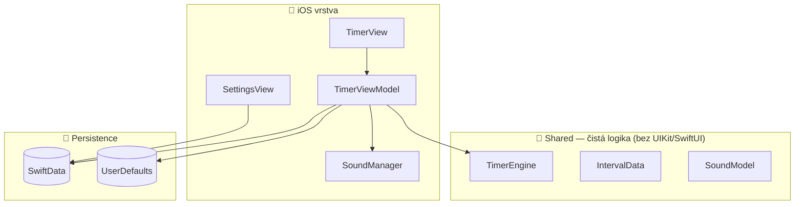

# Gustav Timer

Intervalový časovač pro iPhone navržený pro sport a trénink. Umožňuje sestavit libovolný sled intervalů s názvy a délkami, nastavit počet opakování a spustit timer s vizuální, zvukovou i haptickou zpětnou vazbou.

**iOS 18+ · SwiftUI · SwiftData · verze 2.3.0**

---

## Funkce

### Časovač
- **Intervaly** – až 10 intervalů za kolo, každý s vlastním názvem (max. 12 znaků) a délkou 1–600 sekund
- **Kola** – 1–31 opakování nebo nekonečná smyčka
- **Odpočet** – volitelný 3sekundový odpočet (3-2-1) před startem
- **Skip & Reset** – přeskočení aktuálního intervalu nebo návrat na začátek
- **Always-on display** – během běhu se displej nevypíná
- **Landscape režim** – velký odpočet s přesností na setiny sekundy, tap kdekoliv = start/stop

### Zpětná vazba
- **Zvuk** – 10 zvukových témat (beep, whistle, gong, bell, bicycle, …) nebo ztlumení; přehrávání nepřeruší hudbu na pozadí
- **Tikání** – volitelný zvukový tik každou sekundu
- **Haptika** – odlišné vibrace pro přechod intervalu, konec kola a konec tréninku

### Správa timerů
- **Oblíbené** – ukládání vlastních timerů a rychlý výběr
- **Přednastavené timery** – Tabata, HIIT, EMOM, AMRAP, Meditace (vč. tipů)
- **Vyhledávání** – v oblíbených i přednastavených
- **Sdílení** – export libovolného timeru jako deeplink (swipe vlevo v Oblíbených)

### Vzhled
- **Pozadí** – 10 vestavěných černobílých fotografií
- **Vlastní fotka** – nastavení vlastního obrázku z knihovny jako pozadí
- **Onboarding** – úvodní průvodce a obrazovka „Co je nového"

---

## Technologie

| Oblast | Použité |
|--------|---------|
| UI | SwiftUI |
| Persistence | SwiftData (`TimerData`, `CustomImageModel`) + `@AppStorage` |
| Animace | Lottie (přes balíček GustavUI) |
| Zvuk | AVFoundation (`AVAudioPlayer`) |
| Analytika | TelemetryDeck (anonymní signály o používání) |
| Design systém | **GustavUI** – lokální Swift Package sdílený mezi Gustav aplikacemi (barvy, fonty Martian Grotesk/Mono, komponenty, animace) |

---

## Architektura

Aplikace odděluje **čistou logiku časovače** od platformové vrstvy, takže jádro je sdílitelné i s budoucí Apple Watch verzí.



- **`TimerEngine`** (`Shared/`) je „mozek" aplikace – řídí odpočet (tik každých 10 ms), přepínání intervalů a kol. Neimportuje žádné platformové API; události oznamuje přes callbacky `onFeedback` / `onStart` / `onStop`, které si iOS vrstva napojí na zvuky, vibrace a idle timer.
- **`TimerViewModel`** je tenká iOS obálka nad enginem – doplňuje zvuky, haptiku, Lottie animace, SwiftData persistenci a analytiku.
- **`SettingsView`** edituje hlavní časovač přímo v SwiftData (záznam s `order == 0`).

> Pole `order` v `TimerData` rozlišuje: `0` = aktivní časovač, `> 0` = uložené oblíbené, `< 0` = přednastavené presety.

---

## Struktura projektu

```
GustavTimer/
├── GustavTimerApp.swift      # @main – fonty, TelemetryDeck, modelContainer
├── ContentView.swift         # Root + sheety (Settings/Onboarding/WhatsNew)
├── AppConfig.swift           # Konstanty, presety, URL, pozadí
├── AppSettings.swift         # Sdružená @AppStorage nastavení
├── Models/                   # TimerData, CustomImageModel, PredefinedTimer, …
├── Managers/SoundManager.swift
├── Views/
│   ├── Timer/                # TimerView, TimerViewModel, progress, pozadí
│   ├── Settings/             # SettingsView, FavouritesView, podpohledy
│   ├── Onboarding/ · WhatsNew/
│   └── UI/                   # ControlButton, ProgressBar, ListButton, …
├── Extensions/
├── Sound/  *.mp3             # zvuky + tick
└── Media/   *.mp4            # onboarding videa

Shared/                       # ⭐ Logika sdílitelná s watchOS
├── TimerEngine.swift         # Jádro odpočtu
├── IntervalData.swift        # Model intervalu
├── SoundModel.swift          # Enum zvuků
└── TimeDisplayFormat.swift   # Formát zobrazení času
```

---

## Přednastavené timery

| Preset | Kola | Intervaly | Zvuk |
|--------|------|-----------|------|
| 5 min meditace | smyčka | Meditation 300 s | gong |
| Tabata | 8 | Work 20 s / Rest 10 s | bicycle |
| EMOM 10 min | 10 | Work 60 s | whistle |
| HIIT | 10 | Sprint 30 s / Rest 15 s | whistle |
| AMRAP | 20 | Max 60 s | beep |

---

## Deeplinks

Aplikace zpracovává vlastní URL schéma `gustavtimerapp://` pro načítání timerů z externích zdrojů – webových odkazů, QR kódů, sdílení přes iMessage apod.

### Schéma URL

```
gustavtimerapp://timer?<intervaly>&rounds=<počet>
```

### Formáty intervalů

#### Plný formát – s názvem
Parametr: `název=sekundy`

```
gustavtimerapp://timer?Work=30&Rest=15
```

#### Minimalistický formát – bez názvu
Parametr: jen číslo (sekundy), bez hodnoty. Intervaly se pojmenují automaticky jako „Kolo 1", „Kolo 2" atd.

```
gustavtimerapp://timer?30&15&20
```

#### Kombinace
Oba formáty lze míchat v jednom odkazu.

```
gustavtimerapp://timer?Work=30&15
```

### Parametr `rounds`

| Hodnota | Chování |
|---------|---------|
| `1`–`31` | Pevný počet kol |
| `-1` | Nekonečná smyčka |
| *(neuvedeno)* | Výchozí: nekonečná smyčka (`-1`) |

```
gustavtimerapp://timer?Work=30&Rest=15&rounds=8
gustavtimerapp://timer?30&15&rounds=-1
```

### Limity

| Parametr | Limit |
|----------|-------|
| Počet intervalů | max. 10 |
| Délka intervalu | 1–600 sekund |
| Délka názvu | max. 12 znaků |

Hodnoty mimo rozsah jsou automaticky oříznuty nebo ignorovány.

### Příklady

```
# Tabata
gustavtimerapp://timer?Work=20&Rest=10&rounds=8

# HIIT
gustavtimerapp://timer?Sprint=30&Rest=15&rounds=10

# EMOM
gustavtimerapp://timer?Work=60&rounds=10

# Bezejmenné intervaly
gustavtimerapp://timer?30&15&10

# Nekonečná smyčka
gustavtimerapp://timer?Work=40&Rest=20
```

### Chování po otevření odkazu

1. Aplikace načte intervaly a nastaví počet kol
2. Automaticky otevře nastavení pro kontrolu a případnou úpravu
3. V nastavení se zobrazí informace, že timer byl načten z externího odkazu

### Sdílení timerů

V sekci **Oblíbené** lze swipovat vlevo na libovolný timer a stisknout **Sdílet**. Aplikace vygeneruje deeplink URL se všemi intervaly a počtem kol, který lze poslat přes iMessage, zkopírovat nebo převést na QR kód.

---

## Ostatní deeplinky

```
gustavtimerapp://whatsnew    – zobrazí obrazovku Co je nového
```

---

## Vývoj a build

> [!NOTE]
> Projekt lze sestavit **pouze na macOS s Xcode** (iOS 18 SDK). Závisí na lokálním balíčku `GustavUI` (sousední adresář `../GustavUI`) a na vzdálených balíčcích TelemetryDeck a rive-ios.

```bash
open GustavTimer.xcodeproj
# Build & run: ⌘R (cíl iOS Simulator nebo zařízení)
```

- **Lokalizace** – `Localizable.xcstrings` (angličtina, čeština)
- **Konfigurace** – všechny limity a konstanty jsou v `AppConfig.swift`
- Projekt **nemá unit testy** – ověřuj změny průchodem reálných scénářů (sestavení timeru, start/skip/reset, zvuky, oblíbené, deeplinky).
